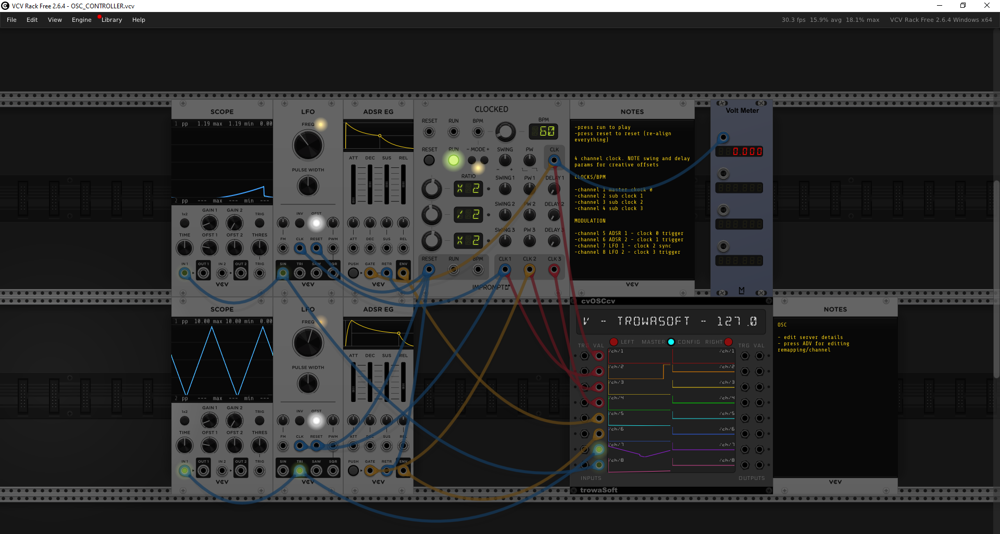
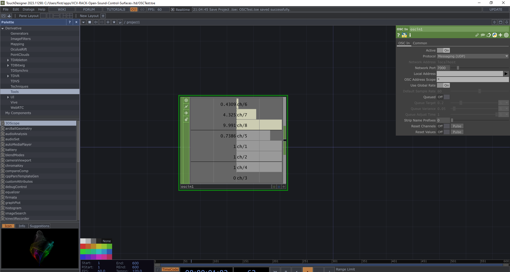

# VCV RACK OSC surfaces

### setup 

- install vcv rack free/premium (vcvrack.com)
- register an account at https://library.vcvrack.com/ (for none default modules)
- add the these dependencies (at least) 
	- impromptu (master clock)
	- trowaSoft (osc module)
- examples are running on port 7000 by defualt 
- /vcv contains the different templates. 
- /td touch designer example as control target

### TO-DO
- more surfaces
- more targets (UE5, Browser/WebGL for sure)

